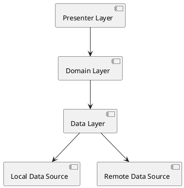
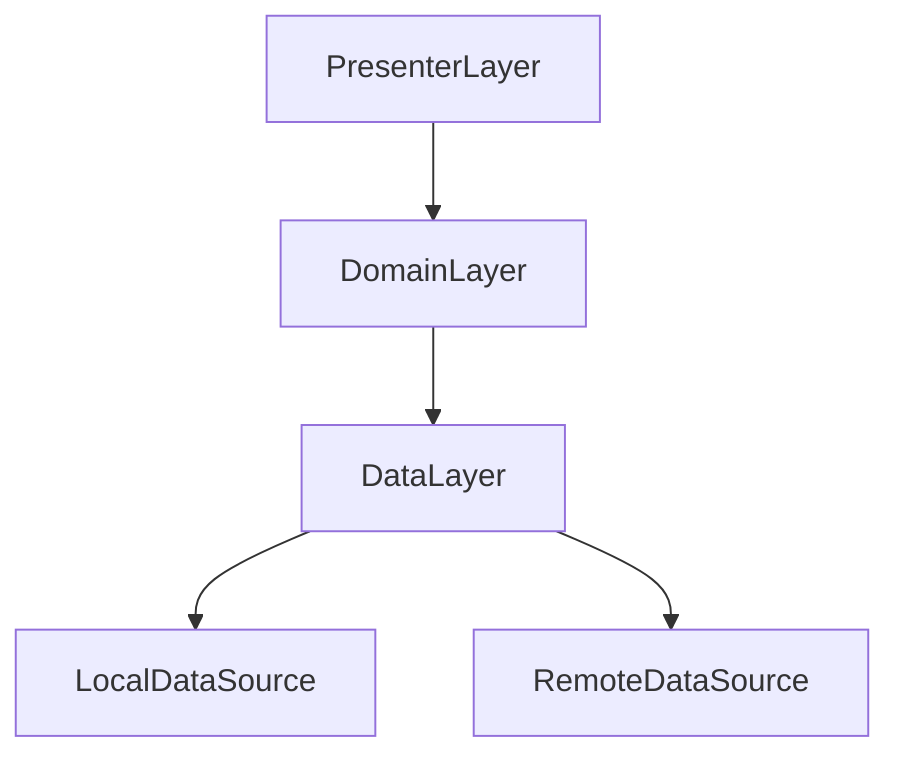

# Project Overview

Hello guys, I'm Phann Pha. I have created this project to experiment with a modularized three-layer architecture:

1. **Data Layer**
2. **Domain Layer**
3. **Presenter Layer**

This architectural approach is designed to separate concerns, improve maintainability, and facilitate testing.

---

## Layers Description

### 1. Data Layer

_Handles data interaction and data source abstraction._

- **Purpose**:  
  Responsible for managing all data-related operations. This includes fetching data from remote servers, local databases, or any other sources required by the application.

- **Main Components and Subfolders**:
     - **helper/**
          - **use_case/**:  
            Contains observable data streams, utilizing RxJava3 for reactive programming patterns.  
            _Example_: Business case observables (e.g., fetchUserProfile, observeLoginStatus).
          - **util/**:  
            Houses utility files, such as those for performance monitoring or enhancing data stream operations.  
            _Example_: Data stream performance utilities, logging mechanisms for network requests.
     - **network/**
          - **area/**:  
            Contains logic for generating base URLs dynamically, depending on the selected environment or variant type (e.g., staging, production).
          - **interceptor/**:  
            Includes interceptors for HTTP requests and responses (e.g., adding authentication headers, logging, or error handling before/after a request is executed).
          - **retrofit/**:  
            Responsible for configuring networking with Retrofit, such as providing an HttpClient, building Retrofit instances, and so forth.
          - **service/**:  
            Maps API services, translating network requests into Kotlin/Java interfaces and endpoints using Retrofit.

### 2. Domain Layer

_Encapsulates business logic and core application rules._

- **Purpose**:
     - Acts as a bridge between the Data Layer and the Presenter Layer.
     - Contains use cases, business logic, and application-specific models.
     - Keeps your business logic independent from frameworks and external layers.

_**Note:** The Domain Layer is often kept as pure as possible, without dependencies on frameworks or Android SDK, making it highly testable and reusable._

### 3. Presenter Layer

_Handles user interface logic and communication with the Domain Layer._

- **Purpose**:
     - Implements presentation logic (e.g., ViewModel, Presenter classes).
     - Prepares and formats data for display on the UI.
     - Receives user events and interacts with the Domain Layer to retrieve or modify data.

- **Tools/Patterns Used**:
     - May use MVVM or MVP architectural patterns.
     - Handles state, navigation, and UI-focused decisions.

---

## Architecture Diagrams

### Architecture Flowchart

```
+-------------------+
|   Presenter Layer |
| (UI & UI Logic)   |
+-------------------+
          |
          v
+-------------------+
|   Domain Layer    |
| (Business Logic)  |
+-------------------+
          |
          v
+-------------------+
|    Data Layer     |
| (Data Sources)    |
+-------------------+
          |
          v
   [ Local & Remote Data ]
```

### UML Diagrams

#### Component Diagram (ASCII)

```
+------------------------------------------------------+
|                <<Presenter Layer>>                   |
|      - View                                         |
|      - ViewModel / Presenter                        |
+------------------------------------------------------+
                |  uses
                v
+------------------------------------------------------+
|                  <<Domain Layer>>                    |
|    - Use Case Classes                                |
|    - Application Models                              |
+------------------------------------------------------+
                |  depends on
                v
+------------------------------------------------------+
|                   <<Data Layer>>                     |
|   - Data Sources (local/remote)                      |
|   - Repository, API Service, Helpers                 |
+------------------------------------------------------+
```

#### PlantUML Diagram

If you use [PlantUML](https://plantuml.com/):



#### Mermaid Diagram

If your Markdown supports [Mermaid](https://mermaid-js.github.io/):



These diagrams help visualize the separation of concerns in your three-layer architecture. For more advanced diagrams, use Draw.io, PlantUML, or Mermaid-supported Markdown platforms.

---

## Benefits

- **Separation of Concerns**:  
  Each layer has a distinct responsibility, making the codebase easier to maintain and scale.
- **Testability**:  
  Isolated business logic and data layers allow for easier unit and integration testing.
- **Flexibility**:  
  Enables independent development, testing, and potential reuse of layers in other projects.

---

## Getting Started

> _Instructions on how to set up, build, and run the project should go here, based on the actual dependencies and requirements of your codebase._

---

If you have questions or would like to contribute, feel free to reach out!
